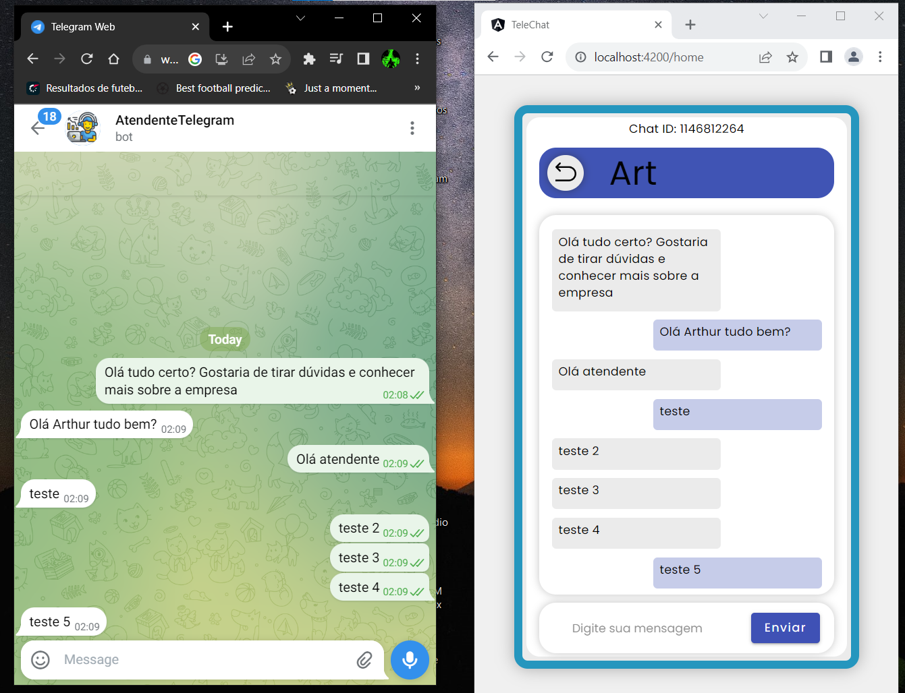

# Desafio do Programador TOTVS

Esse projeto foi desenvolvido para participar do Desafio do Programador 2023 da empresa TOTVS.

## Descrição

O projeto consiste em uma interface de chatweb integrada com a API do telegram para receber e enviar mensagens para usuários.

## Como usar

Execute os arquivos dentro de um ambiente de desenvolvimento anular
````
ng serve
````
Ou execute o index da pasta dist em um host local.
````
npx http-server dist/angular-project
````

## Funcionalidades

* Realizar requests com a API do telegram.
* Receber mensagens de qualquer usuário.
* Adicionar contatos para que fiquem salvos.

## Resumo

O projeto consiste em 2 componentes principais que são o INIT e HOME. O componente INIT é a parte inicial da aplicação onde simula uma tela de login
mas apenas de maneira demonstrativa sem nenhuma lógica de autenticação. Já o componente HOME é a parte principal da aplicação onde possui toda a lógica
e funções necessárias para o envio e recebimento de mensagens via requests do telegram.

**OBSERVAÇÃO:** outra parte da lógica está no data.service que é um objeto de comunicação com a API do telegram e ele que realiza os métodos GET e POST,
através de uma injeção de depência no arquivo .ts do componente home. O ideal seria que toda a parte de informações e comunicação de dados estivesse
dentro desse serviço, porém como esse projeto não requer nenhum nível de segurança e por questões de praticidade, essas informações e suas lógicas
estão em sua maioria contidas no componente HOME.

## Imagens

Exemplo da aplicação aberta ao lado do telegram.



